# Hi 👋, I'm Kartik Gupta

### MAI in Computer Engineering at Trinity College Dublin. I build things that run autonomously and get measured against something real.

- 🔭 I'm currently working on **RailCast, a live rail-delay predictor running on AWS**

- 🌱 I'm currently **working toward an AWS certification**

- 💬 Ask me about **AWS serverless, applied ML on real operational data, and mixed reality on Quest 3**

- 📫 How to reach me **guptakartik30304@gmail.com**

- ⚡ Fun fact **I plan my training like an RPG stat sheet and have been reliably informed that bodies do not work that way**

<h3 align="left">Connect with me:</h3>

<h3 align="left">Languages and Tools:</h3>

&nbsp;

<!--
NOTES, 2026-09-09.

ICONS. Django, Dart and Flask removed at Kartik's request; everything else from the
generator is kept, plus PyTorch and Oracle which were missing and are real. The 17
skillicons ids were each fetched individually and all returned real content, so none
render as a blank tile. The <a> wrappers the generator adds are deliberately gone: it
points every icon at developer.mozilla.org/en-US/docs/Web/<tool>, which 404s for aws,
unreal, unity and most of the rest. Verified 404.

STATS CARDS. Both github-readme-stats.vercel.app URLs returned HTTP 503 on every attempt
across two days, which is why they showed as broken images. That is a free shared
instance and is chronically rate-limited. The streak card is a different service, returns
200, and is kept. Re-check occasionally.

SPACE SECTION. Filled daily by .github/workflows/space.yml. Everything between the
SPACE:START and SPACE:END markers is machine-written; edit around them, never inside.
-->

<!-- SPACE:START -->
<table>
<tr>
<td width="50%" valign="top" align="center">

  
<b>Analemma over the Callanish Stones</b>
 
If you went outside at the same time every day and took a picture that included the Sun, how would the Sun&#x27;s position change? A visual answer to that... <a href="https://apod.nasa.gov/apod/ap260920.html">more →</a>
  
<i>NASA APOD, 2026-09-20</i>
</td>
<td width="50%" valign="top" align="center">

  
<b>Earth, 4 days ago</b>
 
Full-disc Earth from DSCOVR, 1.59 million km out. 4 frames from 2026-09-17; the latest is centred on 6°N 146°W.
  
<i>NASA EPIC aboard DSCOVR, 2026-09-17</i>
</td>
</tr>
</table>

📰 <b>Today in spaceflight:</b> <a href="https://www.esa.int/ESA_Multimedia/Images/2026/09/Pikachu_in_the_Cupola">Pikachu in the Cupola</a> ESA, 2026-09-21

<!-- SPACE:END -->
