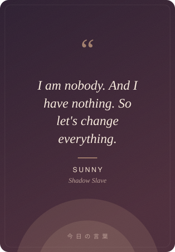

### MAI in Computer Engineering at Trinity College Dublin. I build things that run autonomously and get measured against something real.

- 🔭 I'm currently working on **RailCast, a live rail-delay predictor running on AWS**

- 🌱 I'm currently **working toward an AWS certification**

- 💬 Ask me about **AWS serverless, applied ML on real operational data, and mixed reality on Quest 3**

- 📫 How to reach me **guptakartik30304@gmail.com**

- ⚡ Fun fact **I plan my training like an RPG stat sheet and have been reliably informed that bodies do not work that way**

<h3 align="left">Connect with me:</h3>

<h3 align="left">Languages and Tools:</h3>
<table>
<tr><td align="right"><b>Languages</b></td><td>

</td></tr>
<tr><td align="right"><b>ML &amp; Data</b></td><td>

</td></tr>
<tr><td align="right"><b>Cloud &amp; Databases</b></td><td>

</td></tr>
<tr><td align="right"><b>XR, 3D &amp; Hardware</b></td><td>

</td></tr>
<tr><td align="right"><b>Tools</b></td><td>

</td></tr>
</table>

<picture>
<source media="(prefers-color-scheme: dark)" srcset="https://raw.githubusercontent.com/XxAG17xX/XxAG17xX/output/snake-neon.svg" />

</picture>

<!-- SPACE:START -->
<table>
<tr>
<td width="50%" valign="top" align="center">

  
<b>Chance Triple Alignment: Plane, Space Station, Sun</b>
 
This shot captured an unexpected silhouette. Which is it? It isn&#x27;t the sunspots, the small dark regions caused by concentrated magnetic fields... <a href="https://apod.nasa.gov/apod/ap260922.html">more →</a>
  
<i>NASA APOD, 2026-09-22</i>
</td>
<td width="50%" valign="top" align="center">

  
<b>Earth, 3 days ago</b>
 
Full-disc Earth from DSCOVR, 1.59 million km out. 4 frames from 2026-09-19; the latest is centred on 6°N 156°W.
  
<i>NASA EPIC aboard DSCOVR, 2026-09-19</i>
</td>
</tr>
</table>

<table>
<tr>
<td width="40%" valign="middle"></td>
<td valign="middle">📰 <b>Today in spaceflight</b>  <b><a href="https://www.nasa.gov/organizations/oiir/nasa-welcomes-albania-as-newest-artemis-accords-signatory/">NASA Welcomes Albania as Newest Artemis Accords Signatory</a></b>  NASA, 2026-09-21</td>
</tr>
</table>
<!-- SPACE:END -->

<!-- PICKS:START -->
<table>
<tr>
<td width="25%" valign="top" align="center">

 <b>🎬 ANIME</b>
 <b><a href="https://anilist.co/anime/20623">Parasyte -the maxim-</a></b>
 ⭐ 8.1 · 2014 · 24 eps · Action · Psychological
</td>
<td width="25%" valign="top" align="center">

 <b>📖 MANGA</b>
 <b><a href="https://anilist.co/manga/97830">To Your Eternity</a></b>
 ⭐ 7.9 · 2016 · 202 chs · Adventure · Psychological
</td>
<td width="25%" valign="top" align="center">

 <b>📚 MINDSET</b>
 <b><a href="https://openlibrary.org/works/OL19677694W">Endure</a></b>
 Alex Hutchinson · 2018
</td>
<td width="25%" valign="top" align="center">

 <b>💬 QUOTE</b>
 <b><a href="assets/daily/quote-2026-09-21.svg">Sunny</a></b>
 Shadow Slave
</td>
</tr>
</table>
<!-- PICKS:END -->

<!-- © 2026 Kartik Gupta. All rights reserved; see LICENSE. The SPACE and PICKS blocks are machine-written daily. -->
