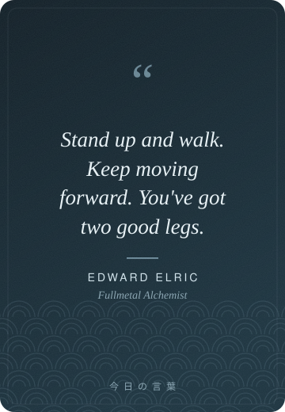

### MAI in Computer Engineering at Trinity College Dublin. I build things that run autonomously and get measured against something real.

- 🔭 I'm currently building **Pagerless, an AI on-call engineer: when an alert fires, it investigates metrics, traces and logs and writes a root-cause report that cites its evidence**

- 🌱 I'm currently **working toward an AWS certification**

- 💬 Ask me about **AWS serverless, applied ML on real operational data, and mixed reality on Quest 3**

- 📫 How to reach me **guptakartik30304@gmail.com**

- ⚡ Fun fact **I plan my training like an RPG stat sheet and have been reliably informed that bodies do not work that way**

<h3 align="left">Connect with me:</h3>

<h3 align="left">Languages and Tools:</h3>
<table>
<tr><td align="right"><b>Languages</b></td><td>

</td></tr>
<tr><td align="right"><b>ML &amp; Data</b></td><td>

</td></tr>
<tr><td align="right"><b>Cloud &amp; Databases</b></td><td>

</td></tr>
<tr><td align="right"><b>XR, 3D &amp; Hardware</b></td><td>

</td></tr>
<tr><td align="right"><b>Tools</b></td><td>

</td></tr>
</table>

<picture>
<source media="(prefers-color-scheme: dark)" srcset="https://raw.githubusercontent.com/XxAG17xX/XxAG17xX/output/snake-neon.svg" />

</picture>

<!-- SPACE:START -->
<table>
<tr>
<td width="50%" valign="top" align="center">

  
<b>NASA Science</b>
 
Have you ever seen the full moon rise? This colorful image was photographed last weekend in Sicily, just outside the town of Nicosia, in Italy. It is... <a href="https://apod.nasa.gov/apod/ap261001.html">more →</a>
  
<i>NASA APOD, 2026-10-01</i>
</td>
<td width="50%" valign="top" align="center">

  
<b>Earth, 3 days ago</b>
 
Full-disc Earth from DSCOVR, 1.58 million km out. 4 frames from 2026-09-28; the latest is centred on 5°N 162°W.
  
<i>NASA EPIC aboard DSCOVR, 2026-09-28</i>
</td>
</tr>
</table>

<table>
<tr>
<td width="40%" valign="middle"></td>
<td valign="middle">📰 <b>Today in spaceflight</b>  <b><a href="https://www.nasaspaceflight.com/2026/10/transporter-18/">Starfish Otter, other payloads set to launch on Transporter 18</a></b>  NASASpaceflight, 2026-10-01</td>
</tr>
</table>
<!-- SPACE:END -->

<!-- PICKS:START -->
<table>
<tr>
<td width="25%" valign="top" align="center">

 <b>🎬 ANIME</b>
 <b><a href="https://anilist.co/anime/6547">Angel Beats!</a></b>
 ⭐ 7.7 · 2010 · 13 eps · Action · Supernatural
</td>
<td width="25%" valign="top" align="center">

 <b>📖 MANHWA</b>
 <b><a href="https://anilist.co/manga/110472">Study Group</a></b>
 ⭐ 7.4 · 2019 · Action
</td>
<td width="25%" valign="top" align="center">

 <b>📚 THRILLER</b>
 <b><a href="https://openlibrary.org/works/OL2664916W">The Bourne Identity</a></b>
 Robert Ludlum · 1980 · ⭐ 6.4
</td>
<td width="25%" valign="top" align="center">

 <b>💬 QUOTE</b>
 <b><a href="assets/daily/quote-2026-09-30.svg">Edward Elric</a></b>
 Fullmetal Alchemist
</td>
</tr>
</table>
<!-- PICKS:END -->

<!-- © 2026 Kartik Gupta. All rights reserved; see LICENSE. The SPACE and PICKS blocks are machine-written daily. -->
